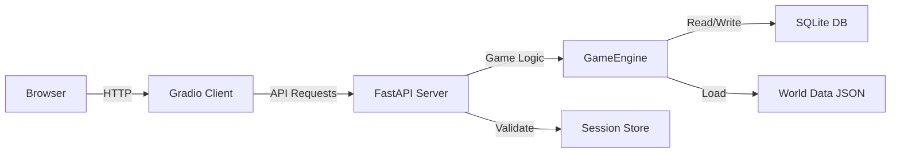
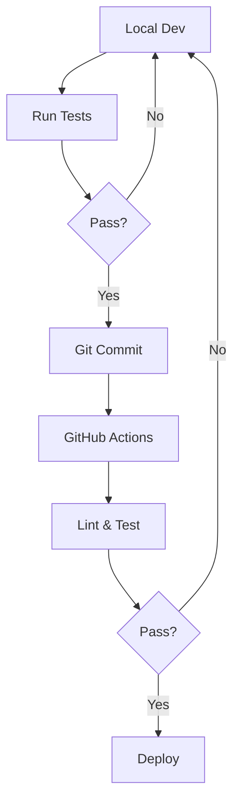

# Architecture

Technical architecture and system design of PipeWorks MUD Server.

## Overview

PipeWorks MUD Server uses a modern three-tier architecture with:

- **FastAPI backend** - RESTful API server
- **Gradio frontend** - Web-based client interface
- **SQLite database** - Persistent data storage

All components are written in Python 3.12+ using modern best practices.

## Architecture Documents

<div class="grid cards" markdown>

-   :material-sitemap:{ .lg .middle } __System Overview__

    ---

    Complete system architecture, data flow, and component interaction

    [:octicons-arrow-right-24: Architecture Overview](overview.md)

-   :material-flask:{ .lg .middle } __Proof of Concept__

    ---

    Current implementation status and technical validation

    [:octicons-arrow-right-24: PoC Details](proof-of-concept.md)

-   :material-database:{ .lg .middle } __Database Schema__

    ---

    SQLite schema, tables, and data structures

    [:octicons-arrow-right-24: Database Design](database.md)

-   :material-api:{ .lg .middle } __API Design__

    ---

    REST API endpoints, request/response models

    [:octicons-arrow-right-24: API Design](api-design.md)

</div>

## System Components

### Backend (FastAPI)

Located in `src/mud_server/api/`:

- **server.py** - App initialization, CORS, routing
- **routes.py** - All API endpoints
- **models.py** - Pydantic request/response models
- **auth.py** - Session management
- **password.py** - Bcrypt password hashing
- **permissions.py** - Role-based access control

### Game Engine

Located in `src/mud_server/core/`:

- **engine.py** - GameEngine class with all game logic
- **world.py** - World, Room, Item dataclasses

### Database Layer

Located in `src/mud_server/db/`:

- **database.py** - SQLite operations, schema, CRUD

### Frontend (Gradio)

Located in `src/mud_server/client/`:

- **app.py** - Main Gradio interface
- **api/** - API client layer
- **tabs/** - UI tab components
- **ui/** - State management and validation

## Data Flow



### Request Flow

1. **Client** - User interacts with Gradio interface
2. **API Call** - Client sends HTTP request to FastAPI
3. **Session Validation** - Server validates session and permissions
4. **Command Parsing** - Server parses command and arguments
5. **Game Logic** - Engine executes command
6. **Database** - Engine reads/writes to SQLite
7. **Response** - Server returns result to client
8. **Display** - Client updates interface

## Technology Stack

| Component | Technology | Purpose |
|-----------|-----------|---------|
| **Backend** | FastAPI 0.125+ | REST API framework |
| **Frontend** | Gradio 6.2+ | Web interface |
| **Server** | Uvicorn 0.38+ | ASGI server |
| **Database** | SQLite 3 | Data persistence |
| **Auth** | Passlib + Bcrypt | Password hashing |
| **Testing** | pytest 8.3+ | Test framework |
| **Linting** | Ruff 0.8+ | Code quality |
| **Formatting** | Black 24.10+ | Code style |
| **Type Checking** | Mypy 1.13+ | Static analysis |

## Key Design Patterns

### Session Management

- **UUID-based sessions** stored in memory and database
- **Session tuples**: `(username: str, role: str)`
- **Activity tracking**: Updated on each API call
- **Validation decorator**: `@validate_session()`

### Role-Based Access Control

- **Four roles**: Player, WorldBuilder, Admin, Superuser
- **Permission enum**: Specific permission types
- **Role hierarchy**: Higher roles inherit lower permissions
- **Decorator**: `@require_permission()`

### Command Pattern

- **Command parsing**: Split into `cmd` and `args`
- **Router**: Delegates to appropriate engine method
- **Response model**: `CommandResponse` with success/message
- **Error handling**: HTTP exceptions for auth/validation

### Repository Pattern

- **Database layer**: Isolated in `database.py`
- **CRUD operations**: Separate functions per entity
- **JSON serialization**: For inventory and complex types
- **Connection management**: Context managers

## Security Considerations

### Authentication

- **Password hashing**: Bcrypt via passlib (intentionally slow)
- **Session IDs**: UUID v4 (hard to guess)
- **Session validation**: On every API call
- **Role tracking**: Sessions store both username and role

### Known Limitations

- Sessions not persisted (lost on restart)
- No session expiration time
- No rate limiting
- No password complexity requirements
- No email verification

See Security Design documentation for details (coming soon).

## Performance

### Current Capacity

- **~50-100 concurrent players** (SQLite limitation)
- **No caching** (every request hits DB)
- **Synchronous DB operations** (aiosqlite available but not used)
- **In-memory sessions** (fast but not persistent)

### Scaling Considerations

For larger deployments:

- Migrate to PostgreSQL for concurrency
- Add Redis for session storage
- Implement caching layer
- Use async database operations
- Add load balancing

## Development Workflow



## File Structure

```
src/mud_server/
├── __init__.py
├── api/              # REST API
│   ├── server.py
│   ├── routes.py
│   ├── models.py
│   ├── auth.py
│   ├── password.py
│   └── permissions.py
├── core/             # Game engine
│   ├── engine.py
│   └── world.py
├── db/               # Database
│   └── database.py
└── client/           # Frontend
    ├── app.py
    ├── api/          # API clients
    ├── tabs/         # UI components
    └── ui/           # State & validation
```

## Configuration

### Environment Variables

```bash
MUD_HOST=0.0.0.0          # Server bind address
MUD_PORT=8000             # Server port
MUD_SERVER_URL=http://localhost:8000  # Client API endpoint
DB_PATH=data/mud.db       # Database path
WORLD_DATA_PATH=data/world_data.json  # World data
```

### CORS

Currently configured for development (`origins=["*"]`).

For production, restrict to specific origins:

```python
CORS_ORIGINS = [
    "https://yourdomain.com",
    "https://www.yourdomain.com"
]
```

## Further Reading

- [System Overview](overview.md) - Detailed architecture guide
- [Proof of Concept](proof-of-concept.md) - Current implementation
- [Database Schema](database.md) - Data model details
- [API Design](api-design.md) - Endpoint documentation
- [Developer Guide](../developer/setup.md) - Development setup
